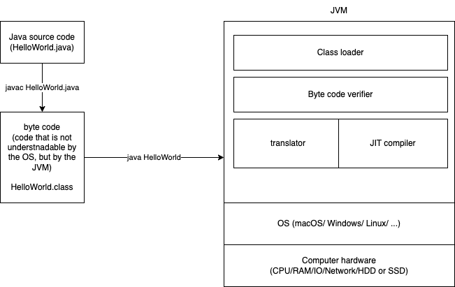

# Day 1

1. Make sure to install JDK 17
1. Add the bin directory location to the PATH environment variable

Some of the important binary executables:

1. javac
   - Java compiler
   - compiles java source code into byte code (machine code for the JVM)
   - OS executes (interprets) the JVM, which interprets your java code (compiled)
1. java
   - Java interpreter (Java Virtual Machine)
1. jar
   - tool for archiving (creating zip files) usually the java class (byte code) files
   - command options are similar to the **tar** command's options in Unix/linux
1. javap
   - decompiler
   - can give you a prototype source code from a byte code
1. jdb
   - CLI debugger
1. jconsole
   - a tool that can give you an insight into a running java process
1. jps
   - Java Process Status
1. javadoc
   - a compiler that converts a Java source code into HTML documentation

Features of Java language:

1. Platform independence
1. Object oriented
1. Robust and secure
1. Rich standard and third party/free/open-source library
1. Multithreading
1. Automatic memory management
1. Platform support - different OS

Advantages:

1. Portability
1. Large active community of developers
1. Scalability and performance
1. Security

Some interesting facts:

- Java was created and maintained by Sun Microsystems in 1992. But, Oracle corporation acquired Sun in January 27th 2010.
- Java became an Open-source software in November 13, 2006 (Under GNU license)
  - this initiation was called as "Open JDK"
- After the acquisition, Oracle corporation became the primary maintainer of Java standards.
- Oracle also chairs the Java Community Process (JCP), which actually standardizes and releases new versions. This is an open source community, and we also can participate in the research and development of Java products

### Writing, compiling and executing a Java program

- In Java, we have to code everything in a file with ".java" extension, which is known as a Java Source file
  - For example, "HelloWorld.java"
- A source file may consist of one ore more Java class definitions
- During compilation, each of the Java classes get compiled into a file of it's own.
  - For example, if there are two classes, called "class Hello" and "class Welcome" in a file called "HelloWorld.java", then the output of compilation of the source code will be two files called "Hello.class" and "Welcome.class"
- To compile a source code, we can use the binary called "javac"
  - javac /path/to/the/file/HelloWorld.java
  - javac /Users/vinod/Documents/TARGET-APR-2023-BATCH-3/day-01/first-example/HelloWorld.java
  - or you can get inside the work folder, where there is source code and simply execute
  - `javac HelloWorld.java`
- General (and one of the good) practice is to keep only one class definition per source code, and also the class must be marked as `public`.
  - if the class is public, then the name of the class and the name of the file (with out extension) must match.
    - For example, file `HelloWorld.java` must contain `public class HelloWorld`
- A class in Java is a container of variables and functions (often referred as methods)
  - you cannot have any executable code (apart from variable declaration and assignment together)
  - for example, you cannot have variable assignments, loops or if conditions, method calls, exception handling directly inside class. All these should be part of a method (or function)
- The package `java.lang` which contains huge number of most commonly used Java classes (library) such as System or String etc. The `java.lang` package members (like System or String) are automatically available to any other classes (such as HelloWorld).
  - classes from other packages, need to be `imported` into your class
- In order for a class to become a program, it must contain a method with the signature `public static void main(String[])`

### What happens when we run the command `java HelloWorld`?

1. JVM (Java Virtual Machine) startup
   - the JVM is invoked
   - JVM is a runtime environment that acts like OS to your Java program, and provides the necessary infrastructure for execution of the program
   - For every instruction from the java program, the JVM translates and talks to the underlying OS
1. Class loading
   - Loads the specified class into the VM from the CLASSPATH
1. Byte code verification
1. Class initialization
   - memory allocation
   - static variable initialization
   - static block execution
   - class dependencies will be resolved
1. Execution of the `main` method
1. Program termination