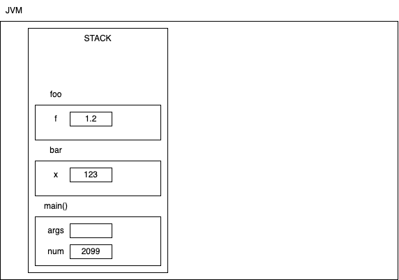

# Data types in Java

- Java is a strongly typed language
- Every variable must be declared before its use and must be declared of a data type

1. Primitive data types:
   - represented by keywords
     - Integers
       - `byte` is a 8 bit signed integer and has a range of -128 to 127
       - `short` is a 16 bit signed integer and has a range of -32,768 to 32,767
       - `int` is a 32 bit signed integer and has a range of -2,147,483,648 to 2,147,483,647
       - `long` is a 64 bit signed integer and has a range of -9,223,372,036,854,775,808 to 9,223,372,036,854,775,807
     - Real numbers
       - `float` is a 32 bit signed single precision decimal and has a range of 1.4E-45 to 3.4028235E38
       - `double` is a 64 bit signed double precision decimal and has a range of 4.9E-324 to 1.7976931348623157E308
     - Characters
       - `char` is a 16 bit type and can represent UNICODE characters
     - Bool
       - `boolean` is a one bit type and can only be assigned with literals `true` or `false`
       - Unlike C/C++ a boolean cannot be derived from non-zero and zero (for true and false)
1. ## Reference types
   - Any variable declared using anything other than the primitives
   - A reference variable is declared using one of the following:
     - class
     - interface
     - enum
     - annotation
     - record

When you declare a variable of primitive, the memory is allocated to the variable itself, and the value is stored in that memory. Unlike this, when you declare a variable of a reference type, the size is fixed (8 bytes). A reference is not going to store the object's values, but will have a `reference` (like a pointer, but not exactly) to the actual object.

Starting from Java 10, we can also use `var` keyword to declare a variable, but the declaration must be accompanied with assignment, so the the type can be inferred from the value.

Wrapper classes:

- a class for each of the primitive data type
- has some useful methods and variables
  - `byte` --> `java.lang.Byte`
  - `short` --> `java.lang.Short`
  - `int` --> `java.lang.Integer`
  - `long` --> `java.lang.Long`
  - `float` --> `java.lang.Float`
  - `double` --> `java.lang.Double`
  - `char` --> `java.lang.Character`
  - `boolean` --> `java.lang.Boolean`



## Creating and using classes in Java

- A class is a template or blueprint for creating objects
- Generally a class in Java defines members:
  - data members (variables) (AKA fields)
  - member methods (functions)
- A class name is created using PascalCase (or TitleCase)
  - For example, `Person`, `ShoppingCart`, `CustomerAddress`, `ArrayIndexOutOfBoundsException`
  - do not use underscores (shopping_cart, customer_address)
- A class can be used for creating variables

  ```java
  class Person {
      String name;
      int age;
  }

  // and in some function,
  Person p1, p2;
  ```

- An object is created by using the `new` keyword along with a call to the `constructor`

  ```java
  // in some function

  Person p1;

  p1 = new Person();
  ```

  

  - The `new` statement allocates memory required for the object of `Person` type in the heap memory.
  - The amount of memory depends on the size of the object and the fields
  - In java, there is no direct mechanism available to find the size of an object
  - After allocating memory for the object, the fields of the object gets initialized
    - this is typically done in the constructor
  - After the initialization, the address of the object in the memory, is recorded in some data structure, and for that address, a serial number (reference) is generated/ assigned. And this newly generated reference is returned by the `new` statement, which then is assigned the LHS (i.e, p1)
