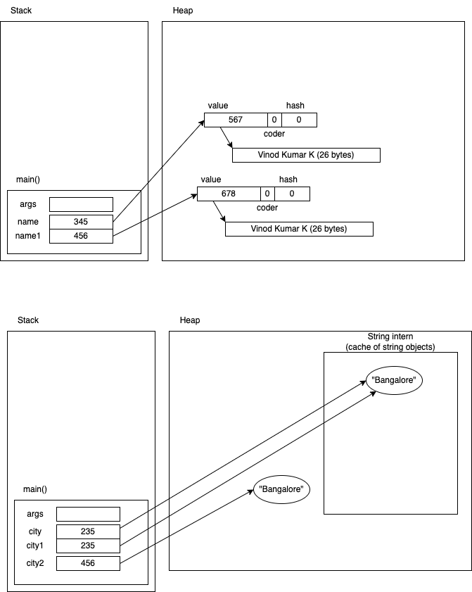

# Strings and Arrays



- Strings are immutable
  - the value inside a string object cannot be modified
  - for example
  ```java
      String name = "Vinod";
      name.toUpperCase();
      log.trace("name is '{}'", name);
  ```

## Arrays

- Why an array is needed?

```java
int n1, n2, n3, n4, n5, n6, n7, n8, n9, n10;
```

- problems with the above:
  1. limited variables
  2. random access is not possible
  - for example, imagine we have a variable called `x` with a value of 5
  - can we access the xth value in the list of variables? (like nx)
- we need a single variable that can hold multiple values
- we should be able access any value using it's position (or index)

Arrays can do exactly same.

- arrays are declared with a special notation using `[]` along with the data type
- arrays can be of primitives or reference types
  - irrespective, the array itself is a reference to an array object


