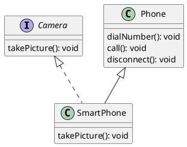

# Interfaces

## Interface

- is a data type for creating reference variables
- is an abstract type
  - an object of this type cannot be created
  - there is no constructor for an interface
- can contain:
  - public static final variables
    - must have an initialization
  - public abstract methods
- starting from Java 8, an interface can contain
  - methods with body, but need to be marked as "default"
  - static methods



- A class may implement an interface
  - the effect of this is the class must implement all abstract methods coming from the interface, or else the class must be declared abstract
    - this was true even for abstract classes
    - hence many people say that `implementing an interface` is similar to `extending an abstract class`

# Exceptions in Java

## Exception

- is an error that occurs at the runtime, during the execution of the program
  - For example, when an integer is divided by zero, the runtime cannot proceed further
  - JRE will create an object of a class called `ArithmeticException` and **thorws** to you
  - We need to **catch** the thrown object, and take an alternate step
  - if we do not do this (handle the exceptional scenario), then the JRE will break the execution of the program (not desirable)

```plantuml

Object <|-- Throwable
Throwable <|-- Exception
Throwable <|-- Error
Exception <|-- unchecked.RuntimeException
IOException <|-- FileNotFoundException
unchecked.RuntimeException <|-- unchecked.ArithmeticException
unchecked.RuntimeException <|-- unchecked.NumberFormatException
unchecked.RuntimeException <|-- unchecked.ClassCastException
unchecked.RuntimeException <|-- unchecked.IndexOutOfBoundsException
unchecked.IndexOutOfBoundsException <|-- unchecked.ArrayIndexOutOfBoundsException
Exception <|-- ClassNotFoundException
Exception <|-- SQLException
Exception <|-- IOException

```
