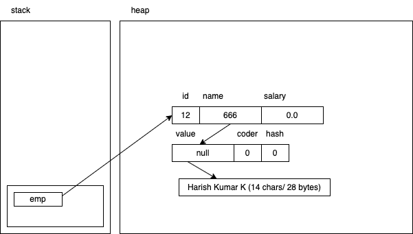

# Serialization

Employee object in the heap

# Importance of `static final long serialVersionUID`

- When an object is serialized and stored in a file, it also stores the class information
- After the data is stored in the file, if we modify the structure of the class in any manner, then the local class's version is different from the one stored in the file
    - this causes a problem during deserialization
- To avoid this issue, we create a static variable called `serialVersionUID`, and as long as this number matches in the stream and the local class, even if there changes in the local class, deserialization will not have any problems