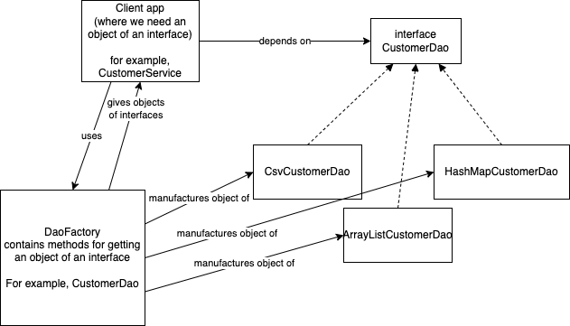

# Factory method design pattern

- a.k.a virtual constructor
- one of the `creational patterns`
- the client app needs an object of an interface
  - the factory method decides and returns an object of the interface
  - there are many methods based on which the factory method decides the right implementation



# Streams API in Java 8

- not to be confused with IO Streams
- introduced in version 1.8 (or Java 8)
- helps work with large amount of data in a collection with out having to loop over the collection
- The `java.util.stream.Stream` is an interface that provides many useful methods, that operate like mathematical operations:
  - filter(Predicate)
  - map(Function)
  - count()
  - min(Comparator)
  - max(Comparator)
  - distinct()
  - sorted()
  - limit(long)
  - skip(long)
  - peek(Consumer)
  - forEach(Consumer)
  - findFirst()
  - findAny()
- each of the methods in the Stream interface can be grouped into two groups
  - which return Stream object (can be used to call another Stream function) (can do statement chaining)
  - which return non-stream type (even void), called as terminal methods

## Functional interface

- an interface with exactly 1 abstract function
- whenever a function requires an object of a functional interface, we can pass an arrow function instead of creating an object of a class that implements that functional interface

- java.util.function.Predicate
  - `boolean test(T t)`
  - can be used as a condition to be checked against the value coming the stream
    - `n->n%2==0`
    - `n -> n>100`
    - `name -> name.startsWith("Mr.")`
    - `emp -> emp.getGender().equals("Male")`
    - `emp -> emp.getSalary()>=50000`
- java.util.function.Consumer
  - `void accept(T t)`
  - the stream passes an element, we just consume it for processing
    - for example, the element the stream needs to be printed or logged
  - The Stream function `forEach` accepts a Consumer object, and is a terminal method. The forEach supplies an element (one at a time) to the arrow function, we can probably print it out
    ```java
        numbers.stream().forEach(num -> System.out.println(num))
        // the java.util.Collection has a method called forEach, so we don't have to convert the
        // list into a stream
        numbers.forEach(a->System.out.println(a));
    ```
- java.util.function.Function
  - `R apply(T t)`
  - takes an argument and returns the same or modified version or anything
  - most commonly used by map operations (map, mapToInt, mapToDouble, ...)
  - For example, we need to convert each number of a stream into the square roots of the same
  - `n->Math.sqrt(n)`
  - `name -> name.toUpperCase()`
  - `name -> name.substring(0, 3)`
- Comparator

```java

class EvenNumberPredicate implements Predicate<Integer>{
    @Override
    boolean test(Integer num){
        return num%2==0;
    }
}

Predicate<Integer> p = new EvenNumberPredicate();

numbers.filter(p).forEach(...)

numbers.filter(num->num%2==0).forEach(...)


```
