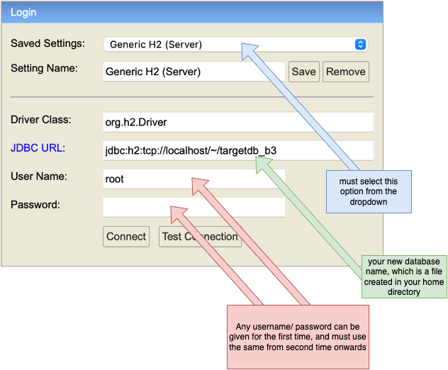
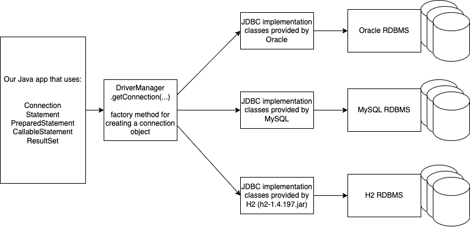

# SQL and JDBC

### SQL

- structured query language
- a language of communication from an application written in any language to any RDBMS
- standardized by ANSI
  - this means the SQL commands must work in any RDBMS
  - however, the vendors provide some additional commands specific to their implementations
- broadly categorize the commands into:

  - DDL (Data Definition Language) - allows to create/modify/delete database objects like table, view, user, etc
    - CREATE
    - ALTER
    - DROP
  - DML (Data Manipulation Language) - allows to add/modify/remove data from the tables
    - INSERT
    - UPDATE
    - DELETE
  - Queries - allow to fetch data from the tables/views etc
    - SELECT
  - Transaction control statements - allows to make the changes done by one user to the data, visible to other users
    - COMMIT
    - ROLLBACK
    - SAVEPOINT

- Popular RDBMS softwares:
  - Oracle
  - MySQL
  - PostgreSQL
  - MS-SQL server
  - IBM DB/2
  - H2
    - popularly used for testing
    - standalone/server modes
    - no installation required)
    - completely written in Java
    - small footprint
    - very fast
  - HSQL
  - Sqlite3 (file based, standalone, no server required)

# Setting up H2 database server

- **VERY IMPORTANT**: use only **1.4.197** version
- Download from mvnrepository using this link:
  - https://repo1.maven.org/maven2/com/h2database/h2/1.4.197/h2-1.4.197.jar
- To start the db server, just double click the JAR file
  - this will start the DB server and opens a web client in a browser
    - if the browser didn't open or you have closed it, you can still visit http://localhost:8082 to open the client web application.
  - Instead of double clicking, we can also issue a command in the command prompt (or terminal)
    - `java -jar h2-1.4.197.jar`

### To create a database or to connect to an existing one

Use the following options:

# JDBC

- Java DB Connectivity
- a standard API provided by Java for connecting to any RDBMS independent of the vendor
  - a set of interfaces and few classes, mainly a factory class (java.sql.\*)
    - interfaces:
      - Driver
      - Connection
      - Statement
      - PreparedStatement
      - CallableStatement
      - ResultSet
    - classes:
      - DriverManager (has a factory method for creating connection to a DB server)
      - Types (has bindings from RDBMS types to Java types)
        - for example, VARCHAR --> java.lang.String
- while we use interfaces in our application, at the runtime we need objects of some classes (vendor specific) that implement the interfaces we uses
  - the implementations are provided by DBMS vendors (for example, MySQL, Oracle etc.,)

