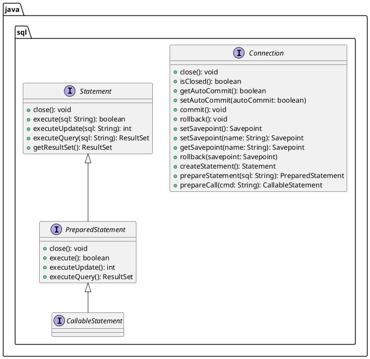

# JDBC

- When we add a JDBC driver dependency to our project, an object of a class provided by the vendor, which implements `java.sql.Driver` is automatically instantiated and registered with `DriverManager`
- We can get the list of all these drivers using the static method `DriverManager.drivers()`, which returns a stream of `Driver` objects

```java
DriverManager
    .drivers()
    .forEach(d -> System.out.println(d.getClass().getName()));
```

- The driver object (of a particular RDBMS vendor) is responsible for any and all activities done on the DB server from our Java application

  - For example, when we need a DB connection, we do this:

  ```java
  Connection conn = DriverManager.getConnection(url, user, password);
  ```

        - here, the getConnection method checks with each of the loaded driver objects, if any of them can accept the URL given (`java.sql.Driver` has a boolean method called `acceptsURL(url)`)
        - if there is no driver that can understand the given URL, an exception is thrown indicating "no suitable driver found"
        - if a driver can understand the given URL, then the DriverManager asks that Driver object to get a DB connection
            - MySQL driver knows how to connect to MySQL DB Server
            - Oracle driver knows only how to connect to Oracle Server

### JDBC URL

For most databases:

```
client-protocol:server-protocol://server-address[:port-number]/db-name
```

For oracle:

```
client-protocol:server-protocol:@server-address[:port-number]:service-id
```

Some examples:

```
MySQL       --> jdbc:mysql://localhost:3306/targetdb_b3
SQL Server  --> jdbc:sqlserver://localhost:1433/targetdb_b3
PostgreSQL  --> jdbc:postgresql://localhost:5432/targetdb_b3
H2          --> jdbc:h2:tcp://localhost/~/targetdb_b3
SQLite      --> jdbc:sqlite:targetdb_b3.sqlite

Oracle      --> jdbc:oracle:thin:@localhost:1521:orcl
```

### java.sql.Connection


