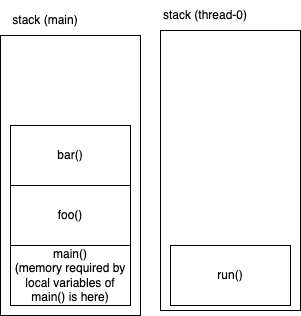

# Multithreading in Java



- A thread is a separate light weight, line of execution with in a single process
- each thread will be associated with a dedicated stack
- when all the stack frames have finished their job, the thread is considered to be dead, and will be removed from the memory
- when a java application starts, JRE starts a new thread called "main", and it calls the "main()" of your app
- we can create new threads, using the `java.lang.Thread` class

```plantuml
class Thread {
    + run(): void
    + start(): void
}
```

## Thread states:

- **New**
- **Runnable**
- **Running**
- **Blocked/Waiting**
- **Terminated/dead**

  
