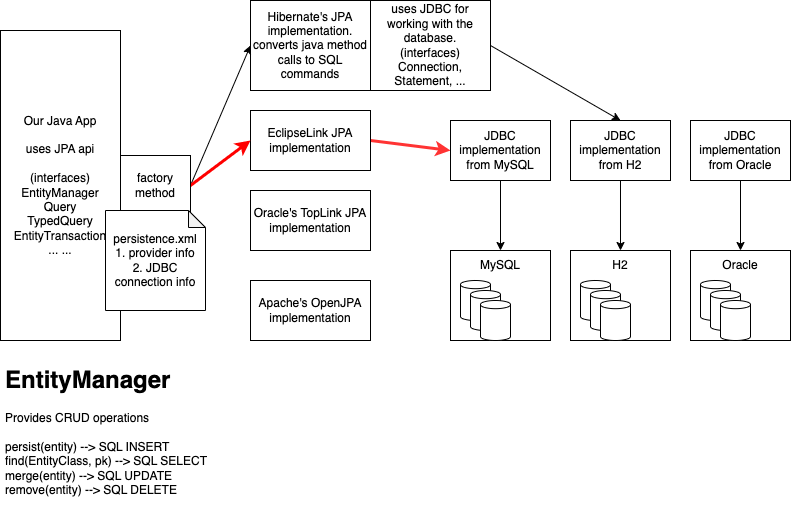

# ORM and JPA

- 1999-2001 Java came with EJB
  - Session beans
    - Stateless
    - Stateful
  - Entity beans (ORM implementation)
    - Bean managed persistence (developer codes persistence mechanism using JDBC)
    - Container managed persistence (the application server manages persistence - NO JDBC involved)
  - Message driven beans
- Very complex architecture
- EJBs run only on application servers
  - cannot use ORM in a standalone or web application

## Need of an ORM

- should handle CRUD operations on an object of a class, while the data resides in an RDBMBS
  ```java
      api.save(emp); // should save the details of this object into a table EMPLOYEES as a record
      api.get(Employee.class, 12); // should get an object of Employee class for the primary key value 12
      api.update(emp);
      api.delete(emp);
  ```
- should be able to recreate the primary-foreign key relationship of records in the form objects
  ```java
      // consider Product and Category classes
      prd1.getCategory(); // should get the category data corresponding to the product
      cat1.getProducts(); // should get the collection of products for a given category
  ```
- should be able to query the entity objects (not the records in a table)

## Hibernate ORM

- introduced in 2002 by Gavin King (RedHat)
- open source and free
- no dependency on any kind of server (in comparison with EJB entity beans)
- works with **plain ordinary java objects**
  - no special functions required (like ejbCreate, ejb\*\*\*)
  - no need to implement any kind of interfaces (like javax.ejb.EntityBean)
  - no need to have any kind of other interfaces (like Home or Remote interfaces)
- when introduced, used XML for mapping class-table, fields-columns
- when annotations were introduced, they switched to annotation based mapping
- API provided interfaces and factory implementations (earlier org.hibernate.\*)
  - org.hibernate.orm.Session (provides CRUD operations on POJOs)
  - org.hibernate.orm.Query (handle querying of objects using HQL similar to SQL)

## JPA?

- Part of EJB 3.x
- Entity beans were removed from the EJB specification, and JPA came as a replacement for the same
- Like Hibernate, JPA can be used as an independent framework for ORM
- standardized the way ORM should be used with the help of interfaces (earlier part of javax.persistence package)
  - jakarta.persistence.EntityManager (provides CRUD operations on POJOs)
  - jakarta.persistence.Query (handle querying of objects using JPQL similar to SQL)
  - jakarta.persistence.TypedQuery
  - jakarta.persistence.NamedQuery
  - jakarta.persistence.NativeQuery (execute an actual SQL command)
- Unlike Hibernate, JPA does not have any default factory implementations
- depends on third party implementation providers
  - Hibernate
  - EclipseLink (from eclipse)
  - Open JPA (from Apache)
  - TopLink (from Oracle)

## JPA architecture




