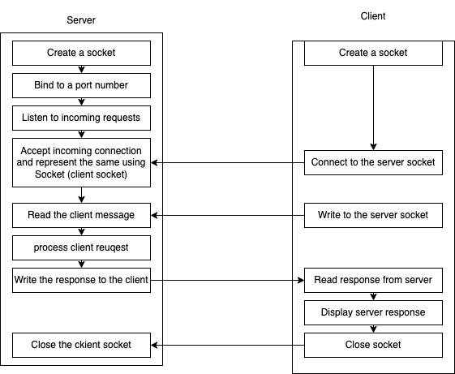

# Network (Socket) programming in Java

- facilitates the communication between two Java applications, may be even running in different computers
- one of the java app is a server app (ServerSocket) and the other one is a client app (Socket)

- The server creates a socket and binds the socket to a port number and then waits for client connection
- The client needs to have the following information to connect to a server:

  - location of the server (IP address or hostname)
  - port number

- The communication here is raw, unlike HTTP where the protocol dictates the language of communication

Here is an example of making a GET request to a URL to access data:

Search movies based on title having "spider man" in the title

```http
GET /?s=spider+man&apikey=aa9e49f
Host: www.omdbapi.com
Accept: application/json
```

Search movie based on IMDB id

```http
GET /?i=tt0145487&apikey=aa9e49f
Host: www.omdbapi.com
Accept: application/json
```

Another popular protocol for sending requests and getting response is SOAP. Here is an example of a SOAP request:

```xml
<?xml version = "1.0"?>
<SOAP-ENV:Envelope
   xmlns:SOAP-ENV = "http://www.w3.org/2001/12/soap-envelope"
   SOAP-ENV:encodingStyle = "http://www.w3.org/2001/12/soap-encoding">

   <SOAP-ENV:Body xmlns:m = "http://www.xyz.org/quotations">
      <m:GetQuotation>
         <m:QuotationsName>MiscroSoft</m:QuotationsName>
      </m:GetQuotation>
   </SOAP-ENV:Body>
</SOAP-ENV:Envelope>
```

### Socket programming in Java

- Server must be ready before a client can send a request
- Client always initiates the request, and the server responds



### Socket programming example requirements:

- The server hosts a bunch of functions
  - factorial(n)
  - power(a, b)
  - sqrt(a)
- The server has to accept client requests repeatedly and run for ever
- The client displays a menu to the user to choose between the operations to be performed
- The client connects to the server and sends a request that consists of
  - information about the method to be invoked on the server
    - method name
    - parameter/s
  - let's use a `Map<String, Object>` to send the request information
    - key `methodName` has a value of the name of the method to be invoked on the server
    - key `args` has an array of all the inputs required for the method invocation
- The server handles each client connections separately using a thread
- reads the Map sent by the client
  - executes the appropriate method based on the request
- writes another Map consisting of the result or an error to the client
- the client will display the result or the error
- the client repeats this process until the user wants to quit/exit

# Java NIO (New I/O)

- a set of Java APIs introduced in 1.4
- provides a more scalable and efficient I/O mechanism (compared to java.io.\*)
- designed to handle large volumes of data
- support non-blocking IO operations
- offers better performance by utilizing the "buffers" and "channels"
