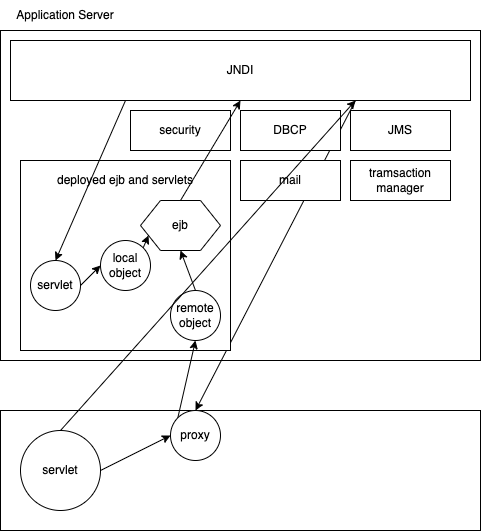
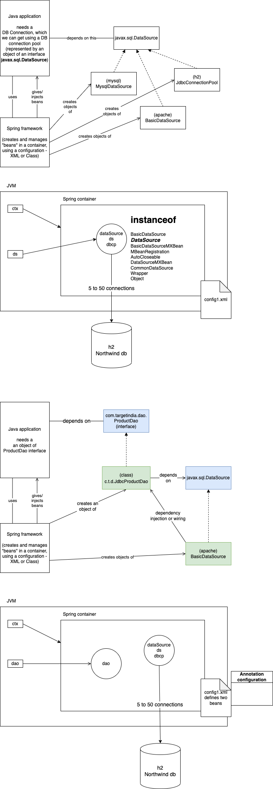

# Spring framework

- Java 2 Enterprise Edition (J2EE) was the way of creating enterprise applications
  - support web application
  - scalable and high performing services using EJB
  - introduced in late 90s
  - we develop components (web/ejb) and deploy them on a J2EE application server
  - the server can be registered with lots of services, and also came with lots of built in services
    - for example, database connection pool, messaging system, security, transaction management etc
    - all services are registered in a directory service called JNDI

EJB 2.x was very very complex to develop

- One EJB consists of
  - a Home interface
  - a Remote and/or Local interface (consists of business logic methods)
  - a class that implements `SessionBean` or `EntityBean` or `MessageDrivenBean`, along with the business methods
    - EJB Standard XML containing the relationship between the above classes and interfaces
    - Vendor specific XML providing some additional deployment information
- All these artifacts then need to be bundled into a JAR file, which then can be given to the server for deployment

## Spring framework as an alternate to EJBs

- create by Rod Johnson in 2003-2004
  - authored the book 'J2EE development with EJB'
- provides IOC and Dependency injection
- modular - jdbc, orm, oxm, tx - web, webmvc, portlet - security - aop
  

## Spring container

