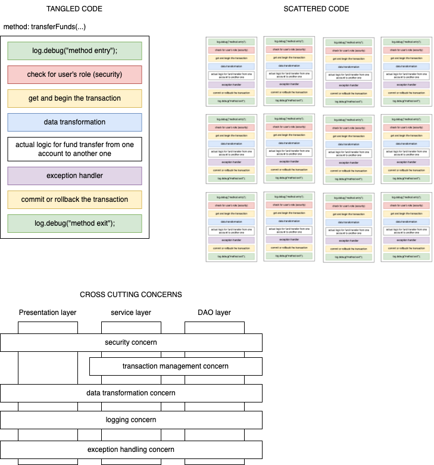
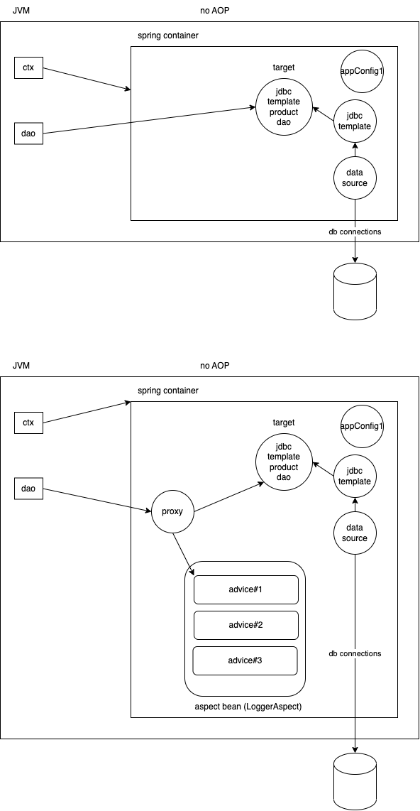

# AOP

- Aspect Oriented Programming
- addresses the separation of concerns (aspects)
- eliminates the cross cutting concerns
  - there are many concerns that cut across different components or parts or layers of an application
  - for example, transaction management, logging, security, data transformation, exception handling etc are different concerns (aspects) that are needed, coded in different parts of the application
    - imagine that we want to log the entry and exit of a method call on methods of DAO, Service and presentation layer
    - assume that on an average there are 25 methods in a DAO interface, and there may be 10 different DAO interfaces.
    - likewise in other two layers.
    - 750 methods in total.
    - this means we would have to use the `log.debug` in 1500 places.
      - this logging is an aspect that is cutting across 3 different layers, making the actual methods in each of these layers a bit bulky (by adding two additional statements)
      - similarly, you are going add at least 3-4 statements for transaction management
        1. `tx = entityManager.getTransaction`
        1. `tx.begin()`
        1. `tx.commit()`
        1. `tx.rollback()`
        - if these are used in around 100 methods, they add an additional 400 statements to your code
      - handling exceptions in each of those 750 methods, would add another 3000 lines of code
      - if some of the methods need to check the user's role before executing, they may add additional code for each of those methods
    - all these makes the actual method bulky
      - code tangling
      - code scattering



## Key concepts of AOP

- **Aspect**
  - the concern with in our application that we want to address by separating it from the actual code
    - transaction management
    - logging
    - security
    - data transformation
    - exception handling
- **Advice**
  - the solution we want provide for the concern
    - the actual logging or data transformation (which we would have tangled and scattered with the actual code, but now we want to separate it from the actual code)
    - 5 different types of advices:
      - @Before advice
      - @AfterReturning advice
      - @AfterThrowing advice
      - @After advice
      - @Around advice
- **Join points**
  - the location in your application where an advice (a method) can be applied (executed)
  - in spring AOP a join point is always a **method execution**
    - for example, when `dao.findDiscontinuedProducts()` is called, we can execute our `log.debug()` statement.
      - before the actual dao method is called
      - after the actual dao method returns the control
      - after the actual dao method throws an exception
      - after the actual dao method completes the execution (irrespective whether or not an exception is thrown)
      - before and after the actual dao method is called
- **Pointcut**
  - a subset of join points based on a predicate
  - this is the actual method execution where the advice being applied
  - Spring uses aspectj pointcut expression language to define the pointcut
- **Proxy**
  - Spring creates a proxy around all the pointcut expressions, and the actual call using the `dao` variable will be executed on the proxy
  - the job of this proxy is to check if there is any advice to be applied (before/after/around/...) and execute the advice method accordingly and then invoke the actual method on the **target** object



## AspjectJ pointcut expression language

Syntax:

```
execution(modifier-pattern? return-type-pattern declaring-type-pattern?.method-name-pattern(argument-pattern|..)) throws-pattern?

```

For example:

```
execution( * com.targetindia.dao.*Dao.find*(..))
```

The above is a representation of any method that has a prefix of `find` declared in any interface that has suffix of `Dao` which are part of the package `com.targetindia.dao` irrespective of the return value type.

```
execution(public int com.targetindia.dao.*Dao.*(..))
```

- any public method of a Dao interface in com.targetindia.dao package only if they return `int` value

```
execution(* com..dao.*Dao.*(double, double))
```

- any method irrespective of their return type declared in any `Dao` class/interface inside a package that starts with `com` and ends with `dao`, only if the method argument has 2 double values
