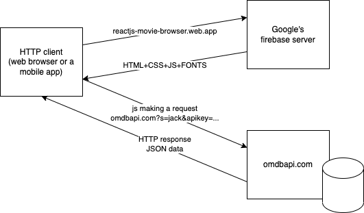

# REST Concepts

REST

- Representational State Transfer
- one of the types of web services

What is a web service?

- a service available/ offered on the web
- Two kinds:
  - SOAP web services
    - standardized by `W3C` in 1999
    - not in use these days
    - very complex
    - too many rules for developers
  - RESTful web services
    - simple alternate
    - concepts originated in early 2000
    - `Roy Fielding` co-creator of HTTP protocol, had mentioned the basic concepts of REST, which came back to life, when people realized the way Web Services being created are very difficult
    - based on 6 constraints
      1. Client/Server
      1. Stateless
      1. Uniform interface
      1. Cacheable
      1. Layered
      1. Code on demand
- an application may consume the services offered on the web (HTTP)
  - https://reactjs-movie-browser.web.app
    - search movies by title (partial)
    - this is hosted on google's firebase server, which serves only static content (HTML/CSS/JS/Fonts)
    - where is the movie data coming from?
      - https://www.omdbapi.com
  - 

JSON

- JavaScript Object Notation
- a standard for data exchange between apps of different kind
- an alternate to XML
- a very simple representation (no data type specification)
- two types of JSON data
  - object
    - a key/value pair of data enclosed in a curly braces
    ```json
    {
      "name": "Vinod",
      "age": 49,
      "married": true
    }
    ```
    - key must be a double quoted string
    - value can be of different types:
      - `string` double quoted text
      - `number` any kind of numerical data including integers and real numbers
      - `boolean` - `true` or `false`
      - `object` - a key/value pair of data enclosed in a curly braces
      - `array` - explained below
      - can also be `null`
  - array
    - a collection of comma separated values enclosed in a square bracket
    ```json
    [
      100,
      "Bangalore",
      true,
      { "city": "Bangalore", "state": "Karnataka" },
      [10, 20, 30]
    ]
    ```

HTTP and REST

- REST
  - --> Representational State Transfer
  - --> Transfer of State in different Representations
  - Client and server exchange data in different formats (JSON (mostly used), XML, CSV etc)
- HTTP has built in features that can be directly used in a REST application
- a `uniform interface` can be achieved via the `URL` or `URI` to represent a `resource`
  - a `resource` is a collection of `state` (data)
  - for example,
    - http://example.com/api/products (represents a resource)
    - http://example.com/api/products/234 (represents the state of a product who's id is 234)

What can be done on a resource or a state?

- we can add a new state to the resource
  - use the HTTP POST method to post a new state, that will be added to the resource
- we can get all/some the states of the resource
  - use the HTTP GET method to get all the states of the resource
- we can update an existing state in a resource
  - use the HTTP GET method to retrieve the current state in the resource identified by the ID
  - use the HTTP PUT or PATCH method
  - use the HTTP DELETE method to delete the state in the resource

How can client/server exchange data in different formats?

- use the MIME types for specifying the format of data exchange
- client uses the HTTP headers (Accept/ Content-Type) to negotiate with the server for the data formats
  - `Accept` --> what the client wants
  - `Content-Type` --> what the clients sends (POST/PUT/PATCH)

Some of the most commonly used HTTP status codes:

1. `200` --> OK
1. `201` --> Created (POST or PUT)
1. `400` --> Bad request (wrong kind of values passed)
1. `401` --> Unauthorized
1. `403` --> Forbidden
1. `404` --> Not found
1. `405` --> Method not implemented (HTTP method used has no handlers on the server)
1. `406` --> Not acceptable (the format of data that the client is asking is not available)
1. `500` --> Internal server error (usually some kind of exception was thrown in the server application)

Full list of status codes are available here: https://developer.mozilla.org/en-US/docs/Web/HTTP/Status

How to setup the REST server for practice?

1. open a terminal (command prompt) in the folder containing `contact-service.jar` file.
1. run the `contact-service.jar` using the Java command:

```cmd
java -jar contact-service.jar
```

Sample requests in RFC2616 format:

```http

GET /api/contacts HTTP/1.1
Host: localhost:8080
Accept: application/json

###

GET /api/contacts HTTP/1.1
Host: localhost:8080
Accept: application/xml

###

GET /api/contacts HTTP/1.1
Host: localhost:8080
Accept: text/plain
### the above results in response status 406

GET /api/contacts/9905ef95-34f2-4dd6-8935-3320c1fd4a18
Host: localhost:8080
Accept: application/json
###

GET /api/contacts/9905ef95-34f2-4dd6-8935-3320c1fd4a18
Host: localhost:8080
Accept: application/xml
###

GET /api/contacts/9905ef95-34f2-4dd6-8935-3320c1fd4a18
Host: localhost:8080
Accept: text/plain

###

GET /api/contacts/9905ef95-34f2-4dd6-8935-3320c1fd0000
Host: localhost:8080
Accept: application/json
### the above request is responded with 404, since the id is invalid

POST /api/contacts
Host: localhost:8080
Accept: application/json
Content-Type: application/json

{
    "firstname": "Vinod",
    "email": "vinod@vinod.co",
    "phone": "9731424784"
}

###
PATCH /api/contacts/8b7637d8-f979-4599-9cc8-22de421be67e
Host: localhost:8080
Accept: application/xml
Content-Type: application/xml

<?xml version="1.0" ?>
<contact>
    <firstname>Vinod</firstname>
    <lastname>Kumar</lastname>
    <city>Bangalore</city>
    <state>Karnataka</state>
    <country>India</country>
</contact>
###
PUT /api/contacts/4ac0183b-bbb5-4c4c-a40f-0972377550c7
Host: localhost:8080
Accept: application/xml
Content-Type: application/xml

<?xml version="1.0" encoding="UTF-8" standalone="yes"?>
<contact>
  <firstname>Vinod</firstname>
  <lastname>Kumar</lastname>
  <email>vinod@knowledgeworksindia.com</email>
  <phone>9844083934</phone>
  <city>Bengaluru</city>
  <state>Karnataka</state>
  <country>India</country>
  <pincode>50078</pincode>
  <picture>https://avatars.githubusercontent.com/u/109946821</picture>
  <gender>Male</gender>
  <address>Elegant Elite, 1st crs, 1st mn, ISRO lyt</address>
</contact>

###
GET /api/contacts/8b7637d8-f979-4599-9cc8-22de421be67e
Host: localhost:8080
Accept: application/json

###
DELETE /api/contacts/8b7637d8-f979-4599-9cc8-22de421be67e
Host: localhost:8080
Accept: application/json

###

GET /api/contacts?state=Massachusetts
Host: localhost:8080
Accept: application/xml

###

GET /api/contacts?city=Bengaluru
Host: localhost:8080
Accept: application/json

###

PATCH /api/contacts/95c41e9e-9b7e-429d-ba4e-5e2e1a44044b
Host: localhost:8080
Accept: application/json
Content-Type: application/json

{
    "city": "Bengaluru",
    "state": "Karnataka",
    "country": "India"
}

###
GET /api/contacts?_page=2&_limit=5
Host: localhost:8080
Accept: application/json
```
