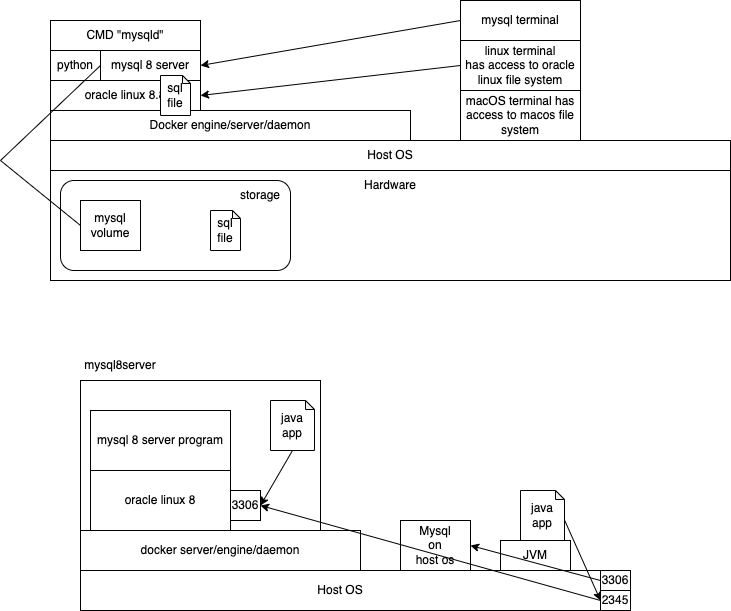

# Docker commands and creating docker images



- `docker pull mysql`
  - downloads the image `mysql:latest` from docker hub
- `docker stop mysql8server`
  - will stop a running container with name **mysql8server** (or you can also give the id)
- `docker start mysql8server`
  - starts a stopped container (if possible)
  - always runs the container in the background
- `docker rm mysql8server`
  - removes the container if it is in the stopped state
- `docker rm -f mysql8server`
  - removes the container forcefully, if it is running
- `docker container prune`
  - removes all the stopped containers from the container cache
- `docker ps`
  - displays the list of all running containers
- `docker ps -a`
  - displays the list of running and stopped containers
- `docker logs mysql8server`
  - displays the logs of a running/stopped container with name **mysql8server**
- `docker exec -it mysql8server sh`
  - executes the command `sh` (or any other command) on the container specified and attaches the current terminal (command prompt) with the command `sh`
- `docker cp northwind-mysql.sql mysql8server:/vinod/workspace`
  - copies a file from the local file system called `northwind-mysql.sql` into the container named as `mysql8server` and to the destination directory `/vinod/workspace` in the container

## Examples:

1. Create a docker container for MySQL server

```
docker run \
    -d \
    -e MYSQL_ROOT_PASSWORD=Welcome#123 \
    --publish 2345:3306 \
    --name mysql8server \
    -v mysql8volume:/var/lib/mysql \
    mysql
```

1. Create a docker container for nginx http server

```
docker run \
    -d \
    -p 80:80 \
    --name nginx-server \
    -v /Users/vinod/Documents/TARGET-APR-2023-BATCH-3/day-32-dockerizing-spring-boot-app/my-website:/usr/share/nginx/html \
    nginx

```

1. Create a wordpress website

```

docker run \
    --name my-blog \
    -p 8080:80 \
    -d \
    --link mysql8server \
    -e WORDPRESS_DB_HOST=mysql8server \
    -e WORDPRESS_DB_USER=root \
    -e WORDPRESS_DB_PASSWORD=Welcome#123 \
    -e WORDPRESS_DB_NAME=vindb \
    wordpress

```

To create your own image, first create a `dockerfile`

Example:

```
from openjdk:17-alpine
workdir /vinod/workspace
copy ./target/customers-service-0.0.1-SNAPSHOT.jar ./app.jar
cmd ["java", "-jar", "./app.jar"]
```

Execute the `docker build` command:

```
docker build \
    -t learnwithvinod/customer-service:latest \
    -t learnwithvinod/customer-service:1.0.0 \
    .
```

notice the `.` at the end. The `dockerfile` will be searched here.

1. create a container for our own `customer-service` image

```
docker run \
    -d \
    --restart=always \
    -p 8080:8080 \
    --link mysql8server \
    --name customer-service-container \
    -e DB_HOST=mysql8server \
    -e DB_PORT=3306 \
    customer-service:latest
```

To publish your image to your own repository at `https://hub.docker.com` use the `docker push` command:

```
docker login
docker push learnwithvinod/customer-service:latest
docker push learnwithvinod/customer-service:1.0.0
```
